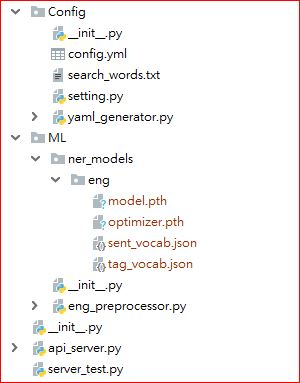
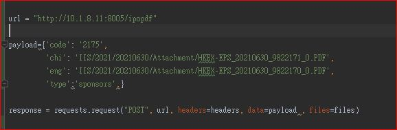
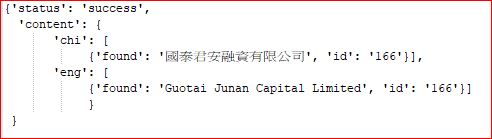
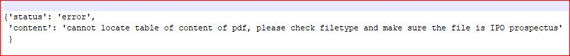

# Introduction

This project is a python-based module, aims to extract the company list (with titles) of IPO sponsors and underwriters from indicated pdf pages from pdf documents of IPO prospectus (English version only).

The main script is the api_server.py and it was run at the background by .service script in UAT and production environment. 

The key inputs of requests include stockcodes, asa filepath and type of information to be retrived (either sponsor or underwriter)

The module is mainly built by python3.7, and the api_server.py mainly uses the open-library pymupdf (https://github.com/pymupdf/PyMuPDF) to read and extract the structure and content of pdf files and relies on two NLP models (one for line gluer  and one for Name entity recongition NER) to process the textual data extracted from PDF and finally apply the another open library, intervaltree (https://github.com/chaimleib/intervaltree) to regroup the company lists of sponsors and underwriters based on their span and location in the paragraph.

--------------------------------------------------------------------------------------------------------------------------------------------------------------------------

### **Module Structures**

# structure of repository

The repository has four key components:
- Config folder : to store the high-level parameter and key settings , including, ip, port, API router and file path of NLP models, etc.
- ML folder: to store file path and settings of two NLP models, line_gluer and Name Entity Recognition (NER). For the training and detail set-up of the two NLP models, please refer to their training repositories, https://github.com/etnetapp-dev/IPO_sponsor_lines_gluer  and https://github.com/etnetapp-dev/IPO_sponsor_NER_model 
- api_server.py: use hug API framework (https://github.com/hugapi/hug) to consolidate all other components and act as API server to communicate between the web-server and all backend functions.

The server_test.py script is designed to test the functionality of the api_server.py script. 

# Why use hug API framework?
hug is a python-based API framework which aims to drastically simplify Python API development process. Besides, it can easily be run by other WSGI based servers (please refer to the github repository :https://github.com/hugapi/hug )

--------------------------------------------------------------------------------------------------------------------------------------------------------------------------
# **Module dependencies** 
### Config:
#### yaml2pyclass : 0.1.0 (source : https://github.com/a-nau/yaml2pyclass  )

### General Utility
#### Numpy: 1.20.3 (source : https://www.numpy.org/ )
#### filetype.py : v1.0.0 (source:  https://github.com/h2non/filetype.py )

### Pdf processing:
#### Pymupdf : 1.18.13 (source : https://github.com/pymupdf/PyMuPDF )

### Machine learning
#### Pytorch : 1.8.1+cpu (source : https://pytorch.org/  )
#### Scikit-learn : 0.24.2 (source : https://scikit-learn.org/ )
#### Scipy: 1.6.3 (source : https://www.scipy.org/ )
#### intervaltree : 3.1.0 (source : https://github.com/chaimleib/intervaltree )

### NLP:
#### Clean-text : 0.4.0 (source : https://github.com/jfilter/clean-text )
#### Rapidfuzz : 1.4.1 (source : https://github.com/maxbachmann/RapidFuzz )
#### Pyflashtext : 2.7.1  (source :  https://github.com/francbartoli/pyflashtext )

### API+Server
#### Hug : 2.6.1 (source : https://hugapi.github.io/hug/ )

--------------------------------------------------------------------------------------------------------------------------------------------------------------------------
# The key components of api_server.py
- table of content search function (locate_pages function) : aims to find out the page numbers containing information of "parties involved" and "underwriting". It is relied on the keywords stored in the "search_keywords.txt" file and compare the text inside "table of content" extracted by the python module: pymupdf or fitz.
- Deployment script of line gluer NLP model (/ML/eng_preprocessor.py) : aims to align the text lines extract from the indicated pages of the pdf file
- Deployment script of the NER model: the script of NER model is inside the api_server.py but the model file (model.pth) and the vocab files are stored in the /ML/ner_model in this repository. 
- company name list and title regroup function: it is stored inside the main function of the api_server.py script

--------------------------------------------------------------------------------------------------------------------------------------------------------------------------
# Input requests and output of the module

There are 3 key parameters to be included in the input request:
- stockcode
- asa pdf file path (both English and Chinese
- datatype : either sponsor or underwriter

User has to send POST requests and put the parameters into payload or into form (when use postman). The header and file of POST requests can be empty.

### **Request input**

The response contains two key components: status and content. If the request is success, the status of response will be "success" and the content will contain both Chinese and English version of Company names in the "found" column ,together with the company ID.

### **normal output**

For exception handle, the status of response will be "failure" and the content will be be message to describe the cause of exception.

There are generally three type of exceptions :
1. cannot download the pdf file to local temporary path --> caused by the error of asa pdf file path
2. cannot locate table of content of pdf --> The Table of content in IPO prospectus pdf file is not detectable
3. cannot detect sponsor/underwriter infomration --> The error from NLP NER models
4. 
### **error output**

--------------------------------------------------------------------------------------------------------------------------------------------------------------------------

--------------------------------------------------------------------------------------------------------------------------------------------------------------------------

--------------------------------------------------------------------------------------------------------------------------------------------------------------------------
